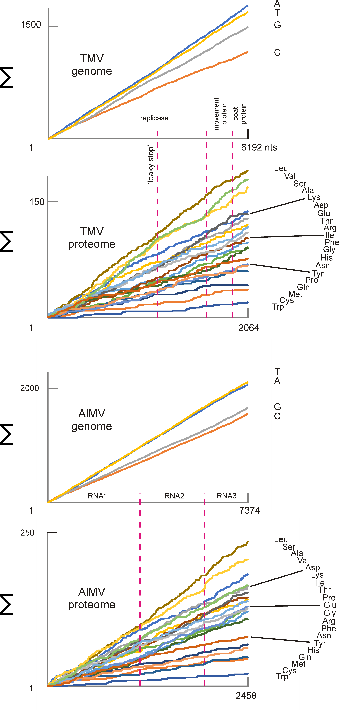

# Σgraphr

Σgraphr converts one or more sequences in a single FAS/FASTA file into **cumulative (left-to-right) character running-sum CSVs**.

For each sequence, Σgraphr:
- detects the distinct characters present (e.g. nucleotides, amino acids, or other codes)
- calculates a running total (∑) across the sequence for each character
- outputs one CSV per sequence, where each column is the cumulative total for one character

These CSVs can be opened in Excel or Google Sheets and plotted as line charts. Characters that are evenly distributed rise smoothly; uneven distributions rise irregularly.

This script is also available online (no code required) at:
http://54.190.199.170/sigma_graphr/

## Output
- **Single sequence input** → one CSV file  
- **Multiple sequences input** → multiple CSV files (often bundled as a ZIP by the included web wrapper)

## Example plot

## Notes
- Input is standard FAS/FASTA: a header line beginning with `>` followed by one or more lines of sequence characters.
- CSV columns represent cumulative totals across positions from left to right.

## Credits / reference
Σgraphr is based on the same general style of cumulative visualization used in SNAP (Synonymous Nonsynonymous Analysis Program) and related sequence-variation approaches.
